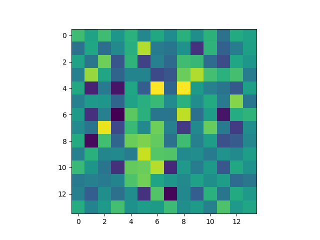

# PHYS449 Assignment 5

## Dependencies

- json
- numpy
- argparse
- python 3.8.10
- tqdm (pip install tqdm)
- matplotlib
- pytorch
- pandas

## Running `main.py`

To run `main.py`, use

```sh
python main.py -o outputs -n 100
```
Additional arguments
```sh
optional arguments:
  -h, --help
  --input_csv INPUT_CSV
                        file_path_to_csv
  --param PARAM         parameter file name
  -o out_dir            filepath to results
  -n num_samples        number of samples
  --animate animate     Boolean to show animation of result
```
param takes in param.json in the format defined below
```json
{
  "exec":{
    "learning_rate": 0.001,
    "num_epochs": 1,
    "batch_size":64,
    "capacity": 64
    }
}
```
Additional feature: animation
```sh
python main.py -o outputs -n 50 --animate True
```
running the above command would result in
